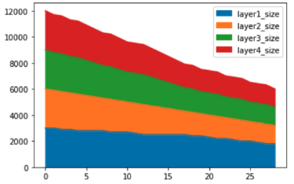

# Project overview

We proposed a grid search algorithm. **We will remove the neuron if the training loss or training accuracy does not change too much after deleting it; we will remove them recursively.**

# How to use

1. First, users should define their own neural network with Pytorch (We use AlexNet as the example):
```python
net = alexnet(num_classes=3, fc_parameter=3000)
net = net.to(device)
```

2. Users also need to define the 'train_get_loss_acc' function; this function will train their model and return the training loss or accuracy. Users can define the hyper-parameters by themselves, such as epoch, batch size, etc.
```python
def train_get_loss_acc(net):
    train_model(net, train_loader, 10)
    acc, loss = eval_network(net, train_loader)
    return acc, loss
```


3. Then, users can import and call our open-source tool with the parameters as shown below. After calling the functions, the reducing process will begin. 
```python
from AutoReduce import AutoReduce

reducer = AutoReduce(train_get_loss_acc, net, device, 100, 0.05, 0.003)
reducer.reduce()
```


# Work flow

The workflow of our open-source framework is as follows: 
1. First, it parses the model and extracts the linear layer of the input model. 
2. Then, it calls the 'train_get_loss' function to get the base loss and base accuracy. The next step will reduce each linear layer's neurons, recalculate the loss and accuracy, and store it in a list. 
3. In the list, we find the best loss or accuracy (lowest loss or highest accuracy).
4. If the best loss and accuracy didn't change within a threshold, we will replace the model with the best loss and accuracy as the base model. Then, go back to step 2. 
5. If the best loss and accuracy change out of the threshold, the reduction will stop and output the current base model.

# Evaluation

## Integrated with TF-Meter

TF-Meter is a measurement and visualization tool for deep neural networks, primarily written in TypeScript. 

We updated and added a button on the front end of TF-Meter ([Updated TF-Meter Github Repo](https://github.com/mastertiller/tf-meter)). Then, we implemented our algorithm in TypeScript and integrated it with TF-Meter. The following figure shows the front end of the updated version of TF-Meter. After clicking the search & reduce button we added, the proposed algorithm will start to reduce the neural network.


## Experiment result


* Dataset: MNIST
* Model: MLP
* Layer size: 2000 neurons
* Num of layers: 3
* Step Length: reduce 100 neurons
* Accuracy Threshold: 0.009
* Loss Threshold: 0.02
* Accuracy: 99.8%
* Model MEC change:  55.00%



* Dataset: Fashion-MNIST
* Model: MLP
* Layer size: 3000 neurons
* Num of layers: 4
* Step Length: reduce 100 neurons
* Accuracy Threshold: 0.01
* Loss Threshold: 0.05
* Accuracy: 86.5%
* Model MEC change: 40.05%


* Dataset: Fashion-MNIST
* Linear Layer size: 2000 neurons
* Num of layers: 3
* Step Length: reduce 100 neurons
* Accuracy: 0.87
* Model MEC change: 0.75
